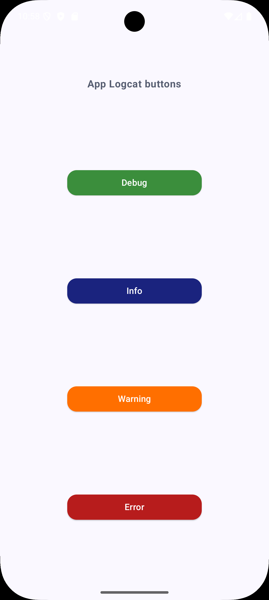
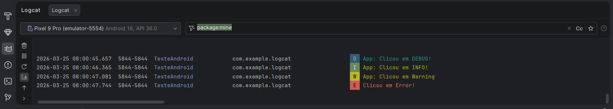
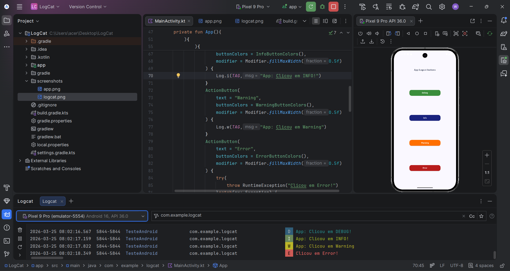

# Logcat Buttons App

Aplicativo Android desenvolvido em **Kotlin + Jetpack Compose** para demonstrar na prática os níveis de log do Android usando a API `android.util.Log`.

## Como funciona

A tela exibe quatro botões. Cada um aciona um nível diferente de log ao ser clicado, e a mensagem aparece imediatamente no painel **Logcat** do Android Studio.

| Botão | Método | Comportamento |
|-------|--------|---------------|
| 🟢 **Debug** | `Log.d()` | Registra mensagem de depuração |
| 🔵 **Info** | `Log.i()` | Registra evento informativo |
| 🟠 **Warning** | `Log.w()` | Registra situação de atenção |
| 🔴 **Error** | `Log.e()` | Lança uma `RuntimeException`, captura no `catch` e registra o erro com stack trace |

> O botão **Error** usa `try-catch` intencionalmente para simular o tratamento real de exceções em produção — o app não crasha, mas o erro fica registrado no Logcat com todas as informações da exceção.

---

## Screenshots

### Tela do app
<div align="center">
  
</div>

### Saída no Logcat


### Android Studio completo


---

## Como executar

```bash
git clone https://github.com/Wallex-Andre/logcat-buttons-app.git
```

1. Abra o projeto no **Android Studio**
2. Execute em um emulador ou dispositivo físico
3. Clique nos botões e observe os logs no painel **Logcat** (filtre por `package:mine`)
